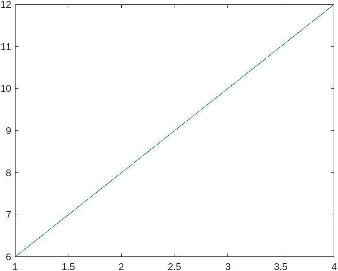
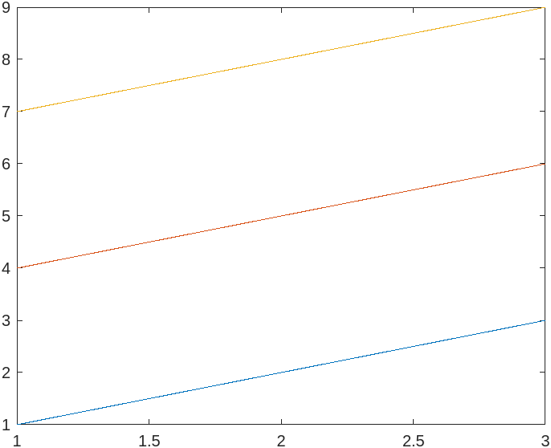
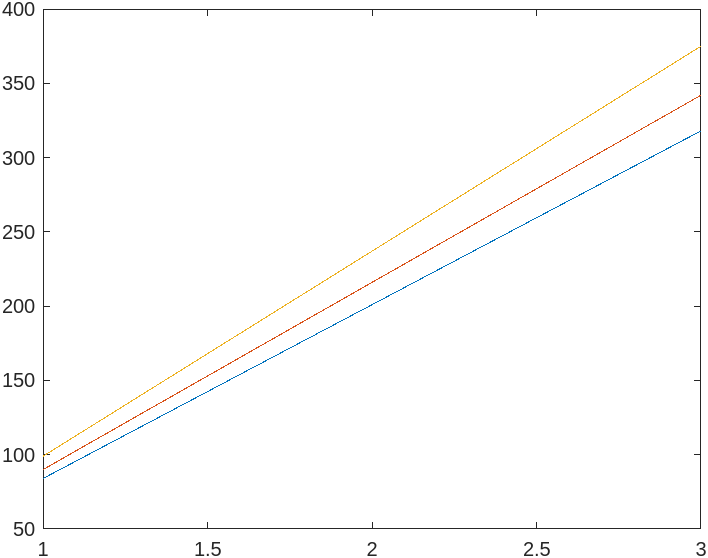
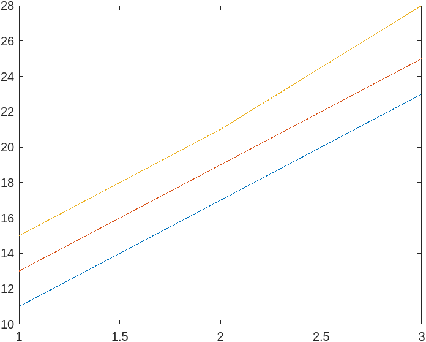
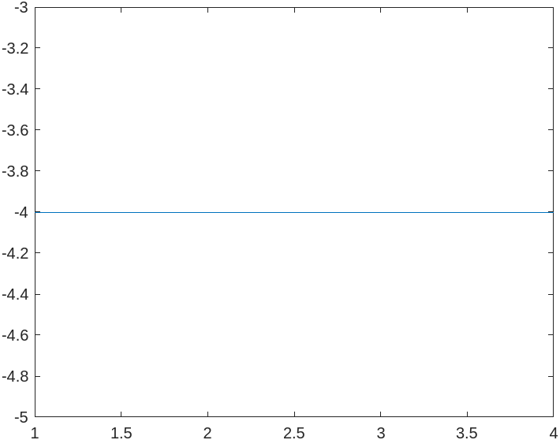

```MATLAB

% Array Addition
a = [1 2 3 4];
b = [5 6 7 8];

c = a + b;
d = a - b;

% Matrix Addition and Multiplication

A = [1 2 3; 4 5 6; 7 8 9; ];
B = [ 10 11 12; 13 14 15; 16 17 19 ];

C = A + B;
D = A * B;

% Transpose a Matrix

E = A';

% Rank of a Matrix

F = rank(A);

plot(c)

plot(d)

plot(C)

plot(D)

plot(E)

```

# Output

## Array Addition



## Matrix Addition and Multiplication

### Matrix Addition



### Matrix Multiplication



## Transpose a Matrix



## Rank of a Matrix


 