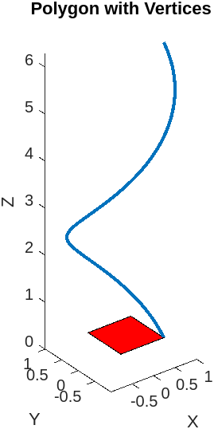

# Input

```MATLAB

% Parametric Space Curve

% Define the parameter t
t = linspace(0, 2*pi, 1000);

% Define the x, y, and z coordinates as functions of t
x = cos(t);
y = sin(t);
z = t;

% Plot the curve in 3D
plot3(x, y, z, 'LineWidth', 2);
xlabel('X');
ylabel('Y');
zlabel('Z');
title('Parametric Space Curve');


% Polygon with Vertices

% Define the vertices of the polygon
x = [0 1 1 0];
y = [0 0 1 1];

% Plot the polygon
patch(x, y, 'r');
axis equal;
xlabel('X');
ylabel('Y');
title('Polygon with Vertices');


% 3D Contour Lines

% Define the function to plot
[X,Y,Z] = peaks(25);

% Plot the contour lines
contour3(X,Y,Z,20);
xlabel('X');
ylabel('Y');
zlabel('Z');
title('3D Contour Lines');


% Pie Chart

% Define the data to plot
data = [20 30 50];

% Plot the pie chart
pie(data);
legend({'Slice 1', 'Slice 2', 'Slice 3'});
title('Pie Chart');


% Bar Chart

% Define the data to plot
data = [10 20 30 40 50];

% Plot the bar chart
bar(data);
xlabel('X');
ylabel('Y');
title('Bar Chart');


```

# Output

## Polygon with Vertices


## Parametric Space Curve



## 3D Contour Lines


## Pie Chart


## Bar Chart

