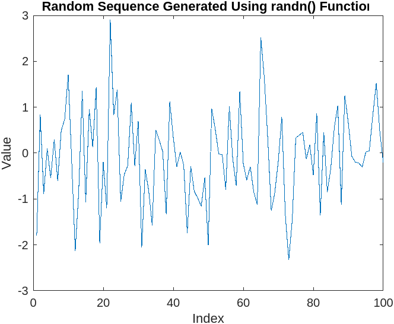

# Input 
```MATLAB

% Add up the values of the elements (Check with sum)
X = [1, 2, 3, 4, 5];
total_sum = sum(X);

% Compute the Running Sum (Check with sum), where Running Sum for element j = the sum of the elements from 1 to j, inclusive.

running_sum = cumsum(X);

% Generate a random sequence using rand() function
seq = rand(1, 100); % generates 1x100 array of random values between 0 and 1

% Plot the sequence
plot(seq)
title('Random Sequence Generated Using rand() Function')
xlabel('Index')
ylabel('Value')

% Generate a random sequence using randn() function
seq = randn(1, 100); % generates 1x100 array of random values from a normal distribution with mean 0 and standard deviation 1

% Plot the sequence
plot(seq)
title('Random Sequence Generated Using randn() Function')
xlabel('Index')
ylabel('Value')

```


# Output

