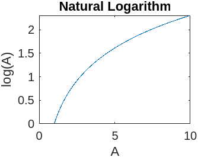
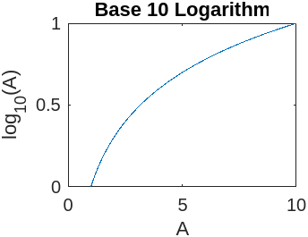
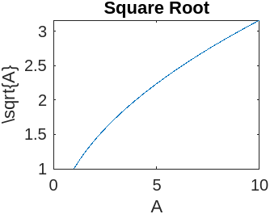
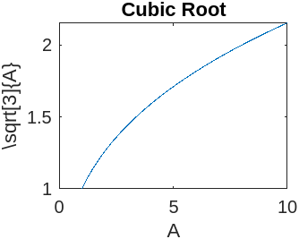

# Input

```MATLAB

% Trigonometric Functions - sin(t),cos(t), tan(t), sec(t), cosec(t) and cot(t) for a given duration, ‘t’.

x = 5.7;
rounded1 = round(x);
rounded2 = floor(x);
rounded3 = ceil(x);
rounded4 = fix(x);

t = 0:0.01:2*pi; 
y1 = sin(t);
y2 = cos(t);
y3 = tan(t);
y4 = sec(t);
y5 = csc(t);
y6 = cot(t);

subplot(2,3,1);
plot(t, y1);
title('Sine Function');
xlabel('t');
ylabel('sin(t)');

subplot(2,3,2);
plot(t, y2);
title('Cosine Function');
xlabel('t');
ylabel('cos(t)');

subplot(2,3,3);
plot(t, y3);
title('Tangent Function');
xlabel('t');
ylabel('tan(t)');

subplot(2,3,4);
plot(t, y4);
title('Secant Function');
xlabel('t');
ylabel('sec(t)');

subplot(2,3,5);
plot(t, y5);
title('Cosecant Function');
xlabel('t');
ylabel('csc(t)');

subplot(2,3,6);
plot(t, y6);
title('Cotangent Function');
xlabel('t');
ylabel('cot(t)');


% Logarithmic and other Functions – log(A), log10(A), Square root of A, Real nth root of A.

A = 1:0.1:10; % sample points from 1 to 10 with 0.1 interval
y1 = log(A);
y2 = log10(A);
y3 = sqrt(A);
y4 = nthroot(A, 3); % 3rd root of A

subplot(2,2,1);
plot(A, y1);
title('Natural Logarithm');
xlabel('A');
ylabel('log(A)');

subplot(2,2,2);
plot(A, y2);
title('Base 10 Logarithm');
xlabel('A');
ylabel('log_{10}(A)');

subplot(2,2,3);
plot(A, y3);
title('Square Root');
xlabel('A');
ylabel('\sqrt{A}');

subplot(2,2,4);
plot(A, y4);
title('Cubic Root');
xlabel('A');
ylabel('\sqrt[3]{A}');


```

# Output







