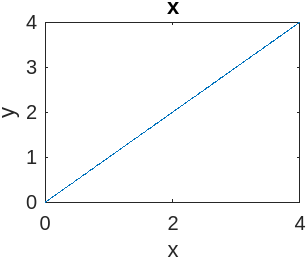
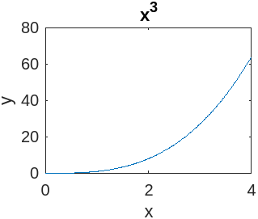
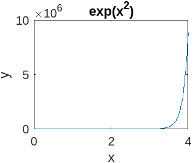

# Input

```MATLAB

% Creating a vector X with elements Xn = (-1)^(n+1)/(2n-1) and adding up 100 elements of the vector X

N = 100; 
X = zeros(1, N);

for n = 1:N
    X(n) = (-1)^(n+1)/(2*n-1);
end

sum_X = sum(X(1:N));

% Plotting the functions x, x^3, exp(x), and exp(x^2) over the interval 0 < x < 4

x = 0:0.01:4;
y1 = x;
y2 = x.^3;
y3 = exp(x);
y4 = exp(x.^2);

subplot(2,2,1);
plot(x, y1);
title('x');
xlabel('x');
ylabel('y');

subplot(2,2,2);
plot(x, y2);
title('x^3');
xlabel('x');
ylabel('y');

subplot(2,2,3);
plot(x, y3);
title('exp(x)');
xlabel('x');
ylabel('y');

subplot(2,2,4);
plot(x, y4);
title('exp(x^2)');
xlabel('x');
ylabel('y');


```

# Output






