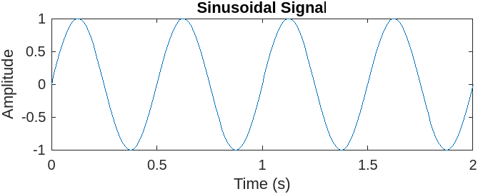
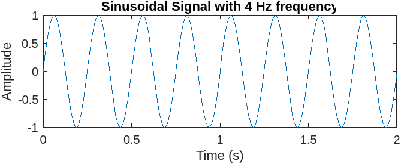

# Input

```MATLAB
% Define the frequency of the signal
freq = 2;

% Define the time duration of the signal
t = 0:0.01:2;

% Generate the sinusoidal signal
x = sin(2*pi*freq*t);

% Plot the signal
plot(t,x);

% Add labels and title
xlabel('Time (s)');
ylabel('Amplitude');
title('Sinusoidal Signal');

% Add legends
legend('Signal');

% Add text
text(1.5,0.5,'Signal Frequency = 2 Hz');

% Print Greek letters
text(1.5,-0.5,'\omega = 2\pi f');

% Generate multiple plots
figure;
subplot(2,1,1);
plot(t,x);
xlabel('Time (s)');
ylabel('Amplitude');
title('Sinusoidal Signal');

subplot(2,1,2);
plot(t,sin(2*pi*4*t));
xlabel('Time (s)');
ylabel('Amplitude');
title('Sinusoidal Signal with 4 Hz frequency');

```

# Output



