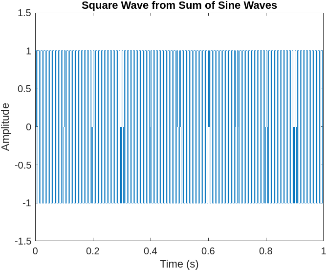

# Input

```MATLAB

% Define the frequency and amplitude of the sine waves
f1 = 100; % frequency of first sine wave
A1 = 1; % amplitude of first sine wave
f2 = 300; % frequency of second sine wave
A2 = 0.5; % amplitude of second sine wave

% Define the time axis and sampling rate
Fs = 10000; % sampling rate
t = 0:1/Fs:1; % time axis

% Generate the sine waves
s1 = A1*sin(2*pi*f1*t);
s2 = A2*sin(2*pi*f2*t);

% Add the sine waves together to create a square wave
square_wave = s1 + s2;
square_wave(square_wave >= 0) = 1;
square_wave(square_wave < 0) = -1;

% Plot the square wave
plot(t, square_wave);
ylim([-1.5 1.5]);
xlabel('Time (s)');
ylabel('Amplitude');
title('Square Wave from Sum of Sine Waves');


```

# Output

